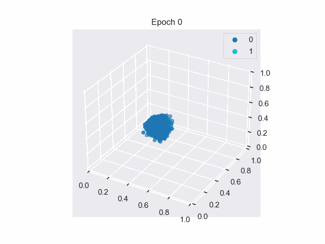

# NNs-and-Deep-Learning

This repo tracks my notes and exercises while completing the book [Neural Networks and Deep Learning](http://neuralnetworksanddeeplearning.com/index.html).

<figure>
  
  <figcaption><em>Weights learnt for each digit in a NN with <b>no</b> hidden layer. This is equivalent to applying a mask / linear transformation. See <a href="./experiments/chap1-no_hidden_layer-MSE_loss.ipynb">this notebook</a> for implementation.</em></figcaption>
</figure>

<figure>
  
  <figcaption><em>Visualising hidden layer with 3 nodes (NN layers: {784,10,3,10}). As epoch increases, the learnt weights push the digits to a corner. Interestingly, digits 4 and 9 are stuck together! See <a href="./experiments/latent-space/">this folder</a> for implementation.</em></figcaption>
</figure>

## Organisation

```
README.md
experiments/  - NN PyTorch class, training experiments
notes/        - markdown notes for each chapter
resources/    - store dataset, model and figures
```

The bulk of the Neural Network class is in [`experiments/digit_classifier.py`](experiments\digit_classifier.py). This has been implemented using PyTorch. 

## Chapter Notes

For each chapter, I have written some notes and answers to most exercises / problems:

- [1 Neural Network Intro](<notes/1 NNs Intro.md>)
- [2 Backpropogation](<notes/2 Backpropogation.md>)
- [3 Improving Learning](<notes/3 Improving Learning.md>)

This is a WIP; I have yet to do the later chapters.

## Optimising Neural Nets

There are many possible avenues to explore with optimising Neural Nets:

- [x] Loss function: MSE, Cross Entropy
- [x] Grid search for mini-batch and learning rate
- [x] Weight init (automagically done in PyTorch)
- [ ] Learning rate schedule: hold learning rate constant until the _validation_ accuracy worsens, then decrease $\eta$ by 2-10x
- [ ] Regularisation
  - [ ] L1
  - [ ] L2
  - [ ] Dropout
  - [ ] ~~Dataset Augmentation~~
- [ ] Softmax in the output layer (This may be demonstrated in a later chapter)
- [x] Visualising hidden layer