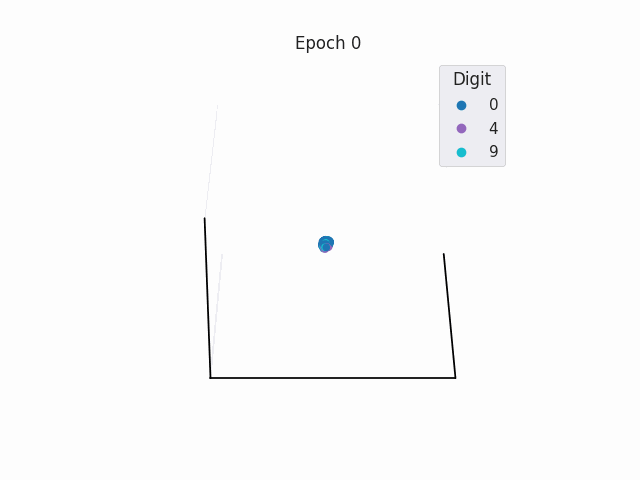

# NNs-and-Deep-Learning

This repo tracks my notes and exercises while completing the book [Neural Networks and Deep Learning](http://neuralnetworksanddeeplearning.com/index.html).

<figure>
  
  <figcaption><em>Visualising hidden layer with 3 nodes (NN layers: {784,10,3,10}). As epoch increases, the learnt weights push each digit class to a corner. Interestingly, digits 4 and 9 are stuck together! See <a href="./experiments/classifier/latent-space/">this folder</a> for implementation.</em></figcaption>
</figure>

<br/>
<br/>
<br/>

<figure>
  
  <figcaption><em>Weights learnt for each digit in a NN with <b>no</b> hidden layer. This is equivalent to applying a mask / linear transformation. See <a href="./experiments/classifier/chap1-no_hidden_layer-MSE_loss.ipynb">this notebook</a> for implementation.</em></figcaption>
</figure>

## Organisation

```
README.md
experiments/  - NN PyTorch class, training experiments
notes/        - markdown notes for each chapter
resources/    - store dataset, model and figures
```

The bulk of the Neural Network class is in [`experiments/classifier/digit_classifier.py`](experiments/classifier/digit_classifier.py). This has been implemented using PyTorch. 

## Chapter Notes

For each chapter, I have written some notes and answers to most exercises / problems:

- [1 Neural Network Intro](<notes/1 NNs Intro.md>)
- [2 Backpropogation](<notes/2 Backpropogation.md>)
- [3 Improving Learning](<notes/3 Improving Learning.md>)

This is a WIP; I have yet to do the later chapters.

## Experiment Ideas

### Optimising Neural Nets

There are many possible avenues to explore with optimising Neural Nets:

- [ ] Grid search over batch-size, lr using hydra
- [ ] Regularisation: L1, L2, Dropout

### VAEs

- [ ] Visualise training of latent space in 2D / 3D - does this have the same representation as the classification exercise?
  - There are three phases to the KL loss (which is very apparent for `latent_dim=8`):
    1. KLD starts high, due to random initialisation of the model.
    2. KLD drops almost to 0, as the model learns to encode as a Gaussian very easily
    3. KLD rises sharply to compensate for the high MSE reconstruction loss. 
    4. KLD increases slowly to match the MSE loss.
- [ ] Train beta-VAE for disentangle latent space.
  - compare latent space training
  - show how sliders affect the reconstruction: vary the value of each latent from -3 to 3 (3 sigmas)
- [ ] Find path that traverses all digits in latent space
- [ ] Classify digits in complete latent space (would be best to have a confined latent space)