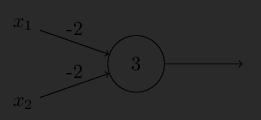
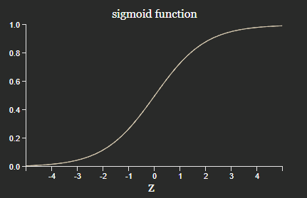
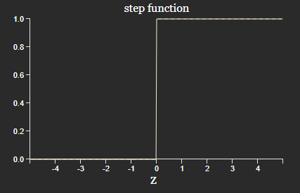
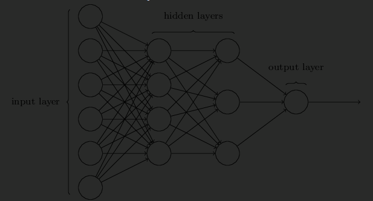

# Neural Networks and Deep Learning

This markdown file contains my notes when reading through the book
[Neural Networks and Deep Learning](http://neuralnetworksanddeeplearning.com/index.html).

## Chap 1

### Perceptron

$$
\text{output} =
  \begin{cases}
    0 \ \text{if} \ w \cdot x + b \le 0 \\
    1 \ \text{if} \ w \cdot x + b > 0
  \end{cases}
$$

> bias is a measure of heasy it is to get the perceptron to output a 1

A network of perceptrons can be equivalent to a NAND gate:

- This means that perceptrons are "no better" than our basis of computation.
- How do we implement "learning"!

### Sigmoid / logistic neuron

Aim: Make neuron differntiable

$$
y = \sigma(w \cdot x + b)
$$

Sigmoid function is used because it has good analytical properties when differentiating.

Neuron becomes a perceptron if the activation function is a step: $y = H(w \cdot x + b)$ (actually $H(0) = 0$, but a perceptron is 1).

### Excercises

> 1. Sigmoid neurons simulating perceptrons, part I

Multiplying by a constant $c > 0$ will not change the network, because $H(cz) = H(c)$. Also, considering the decision boundary algebraically

$$
\begin{align*}
  \text{Decision boundary} \\
  w \cdot x + b &\le 0 \\
  \text{Multiplying by } c \\
  c \ (w \cdot x + b) &\le 0 \\
  \implies w \cdot x + b &\le 0 \\
\end{align*}
$$

> 2. Sigmoid neurons simulating perceptrons, part II

In the limit $c \to \inf \implies \sigma(cz) \to H(z)$, hence a sigmoid neuron tends to a perceptron. Note that this becomes unstable / fails when $z = 0$, because it is unclear which size the sigmoid will predict.

## Architecture of NNs

### Multilayer Perceptrons (MLPs)

- Note: Confusingly, these use sigmoid activation functions (as opposed to perceptrons)

There are some design / engineering heuristics used when deciding on the hidden layers:

- TODO

Other networks:

- Feed forward networks
  - information flows forwards
  - MLP is a type of FFN
- Recurrent Neural Networks
  - information can flow in loops
  - Some neurons fire for some time before becoming quiscient

### Exercise - Network to recognise digits

Intersting thought: The output layer is composed of 10 Neurons.
What if this was changed to a bitwise representation composed of 4 neurons?

Ans: In some sense, the neurons fire based on part of the shape of a digit. It would be difficult to associate that to the most significant bit of a digit compared to the number itself!

> There is a way of determining the bitwise representation of a digit by adding an extra layer to the three-layer network above.
> The extra layer converts decimal to binary:

| Binary | 0    | 1    | 2    | 3    | 4    | 5    | 6    | 7    | 8    | 9    |
| ------ | :--- | :--- | :--- | :--- | :--- | :--- | :--- | :--- | :--- | :--- |
| $B_3$  | 0    | 0    | 0    | 0    | 0    | 0    | 0    | 0    | 1    | 1    |
| $B_2$  | 0    | 0    | 0    | 0    | 1    | 1    | 1    | 1    | 0    | 0    |
| $B_1$  | 0    | 0    | 1    | 1    | 0    | 0    | 1    | 1    | 0    | 0    |
| $B_0$  | 0    | 1    | 0    | 1    | 0    | 1    | 0    | 1    | 0    | 1    |

From this table, it is obvious that the weights of the neurons are simply $w_\text{binary, decimal}$ as per the table above. (Assuming that the correct output has activation > 0.99, and the incorrect activation  < 0.01).

## Learning with Gradient Descent

Cost function / loss function:

$$
C(w,b) := \frac{1}{2n} \sum_x \lVert y(x) - a \rVert_2 ^2
$$

where, $a$ is the output from the network. 

- $C$ is commonly referred to as _quadratic cost_ or _mean square error (MSE) cost_.
- Note: Quadratic cost is a useful proxy as a measure of accuracy. This cost function is useful because it's differentiable, whereas the accuracy (precision) is not!

Consider the gradient of this:

$$
\Delta C \approx \nabla C \cdot \Delta v
$$

where $\Delta v$ is the change in the inputs to the Cost function. Consider choosing $\Delta v$:

$$
\begin{align*}
  \Delta v &= - \eta \nabla C \\
  \implies \Delta C &= \nabla C \cdot - \eta \nabla C \\
  &= - \eta \lVert \nabla C \rVert^2 \\
  & \le 0
\end{align*}
$$

Thus if we could choose how to change the input parameters, then we could traverse the cost function so that it is always decreasing until reaching a local minimum.

$$
v \to v' = v - \eta \nabla C
$$

- The equation only applies locally, so the learning rate $\eta$ needs to be chosen small enough such that $\Delta C \le 0$ holds.
- On the flip side, we don't want the learning rate to be too small, otherwise this algorithm will converge too slowly, or will be stuck in a local minimum.
- In practice, the learning rate is varied

### Exercise

> Given a fixed step size $\lVert \Delta v \rVert = \epsilon > 0$, to minimise $\Delta C = \nabla C \cdot \Delta v$, the optimal move is $\Delta v = - \eta \nabla C$, where $\eta = \epsilon / \lVert \nabla C \rVert$.

To prove this, consider $\Delta v = - \eta \nabla C + u$ for some $u$ such that $\Delta v$ represents any vector. 

$$
\begin{align*}
\lVert \Delta C \rVert & \approx \lVert \nabla C \cdot \Delta v \rVert \\
&= \lVert \nabla C \cdot (- \eta \nabla C + u) \rVert \\
&= \lVert - \eta \nabla C \cdot \nabla C + \nabla C \cdot u \rVert \\
\text{Cauchy-Schwarz inequality:}\\
& \le \lVert - \eta \nabla C \cdot \nabla C \rVert + \lVert \nabla C \cdot u \rVert \\
&= \eta \lVert \nabla C \rVert^2 + \lVert \nabla C \cdot u \rVert \\
\text{Sub in for } \eta \\
&= \epsilon \lVert \nabla C \rVert (1 + u) \\
\end{align*}
$$

This expression is obviously minimised for $u = 0$ as required.

> What happens when $C$ is a function of one variable?

When $C$ is multivariable, $\Delta C$ is the directional derivative in the direction of $\Delta v$. Note that $\nabla C$ points in the direction of maximum increase, hence by choosing $\Delta v \propto - \nabla C$, we traverse $C$ in the direction of maximum of _descent_. In 1D, this corresponds to moving left/right.

### Stochastic Gradient Descent (SGD)

It is computationally intensive to calculate the cost function for _all_ training inputs $x$. Instead, a _mini-batch_ of size $m$ is used to estimate the gradient:

$$
\Delta C = \frac{1}{n} \sum_x C_x \approx \frac{1}{m} \sum_{j=1}^m  C_{x_j}
$$

Gradients are recalculated for each _mini-batch_ until all training data is used up. This is equivalent to one _epoch_.

Interestingly, if the approximation is good enough, then we perform the descent a lot quicker, because after one epoch, we would have performed $n/m$ updates instead of just 1!

### Exercise

> An extreme version of gradient descent is to use a mini-batch size of just 1... This procedure is known as _online, on-line_, or _incremental learning_. 

Adv: Updates very fast (every time after seeing a new training example)
Dadv: Can overfit to the training example

## Implementing our network to classify digits

- See `chap1.ipynb` to see use of pytorch to train a Neural Network.
- Interestingly, VSMs can get a performance close to 98.5% accuracy. 

### Exercise

> Try creating a network with just two layers

This achieved an accuracy of 91% with `learning rate = 1, mini batch = 30`. This is a lot better than I expected! Though, with a hidden layer of 30 and `learning rate=3`, a much better performance of 95% was achieved see [this post](https://peekaboo-vision.blogspot.com/2010/09/mnist-for-ever.html) and the [sklearn tutorial on RBFs with SVM](https://scikit-learn.org/dev/auto_examples/svm/plot_rbf_parameters.html).

Interestingly, having no hidden layer is equivalent to learning from a linear model. 

$$
\begin{align*}
\text{Neurons for Digit 1 } y_1: \\
z_1 &= w_1 \cdot x + b\\
y_1  &= \sigma(w_1 \cdot x + b) \\
\text{Gradient} \\
\frac{\partial y_1}{\partial x} &= \frac{\partial \sigma}{\partial z_1} \frac{\partial z_1}{\partial x}
\\
\sigma \text{ is monotonic, so} \\
\left[\frac{\partial y_1}{\partial x}\right] 
&= \left[ \frac{\partial z_1}{\partial x} \right]
= \vec{0}
\\
\text{at a stationary point.}\\ \\
\end{align*}
$$

Note this is a heuristic calculation (we should really be comparing the gradients of the cost function, but the idea is the same). Since $\sigma$ is monotonic, the theorerical global optimum will be the same as a linear model!
However, since we use SGD instead of say OLS (ordinary least squares), we may trade-off being less overfit at the expsnse of hitting a local optimum (i.e performing worse on the training set but perhaps better on the validation set).

Note also:
$$
\text{sign}\left[\frac{\partial y_1}{\partial x}\right] 
= \text{sign} \left[ \frac{\partial z_1}{\partial x} \right]
$$

This is the elementwise $\text{sign}$ function: essentially each element will have the same sign, hence the gradients will be pointing in the same direction. This means that the gradient updates will be in the same direction as if it were a linear model (though the magnitude of the updates will be differen due to the non-linear sigmoid scaling).

Fun:

$$
\text{sophisticated algorithm} \le \text{simple learning algorithm} + \text{good training data}
$$

## Toward Deep Learning

- NN are hardly intepretable
- NNs with many hidden layers didn't perform very well in the 80s or 90s. Some techniques in 2006 were introduced which drastically improved this.
